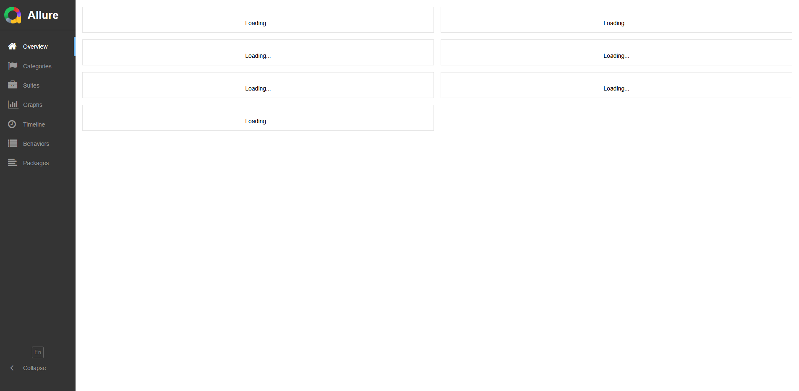

# Simbirsoft UI Tests

UI-автотесты для формы: https://practice-automation.com/form-fields/

Проект выполнен на Python 3.10 с использованием Selenium WebDriver, pytest и Allure.
Реализованы паттерны: Page Object Model, Page Factory, Fluent Interface.

## Стек
- Python 3.10
- pytest
- Selenium WebDriver (Chrome)
- Allure
- python-dotenv
- GitHub Actions

## Установка
```bash
py -3.10 -m venv .venv
.venv\Scripts\activate
python -m pip install --upgrade pip
pip install -r requirements.txt
```

## Запуск тестов

Запуск всех тестов:
```bash
pytest
```

Запуск в headless-режиме:
```bash
pytest --headless
```

Запуск только smoke-тестов:
```bash
pytest -m smoke
```

Запуск только regression-тестов:
```bash
pytest -m regression
```

## Allure-отчёт

Генерация и просмотр локально:
```bash
pytest --alluredir=allure-results
allure serve allure-results
```

## Allure-отчёт (GitHub Pages)

[Ссылка на отчёт](https://fyodorzvygintsev.github.io/simbirsoft-ui-tests/)

## Скриншот Allure-отчёта



## Структура проекта
```text
simbirsoft-ui-tests/
├── .env                    # Конфигурация (URL, таймаут, headless)
├── .github/workflows/      # CI/CD pipeline (GitHub Actions)
├── config.py               # Загрузка настроек из .env
├── conftest.py             # Фикстуры pytest (браузер, ожидания, Allure)
├── pytest.ini              # Настройки pytest и маркеры
├── requirements.txt        # Зависимости Python
├── pages/
│   └── form_page.py        # Page Object - логика работы с формой
├── utils/
│   └── page_factory.py     # Page Factory - обёртка над Selenium
├── tests/
│   └── test_form.py        # Тесты (smoke, позитивный, негативный)
└── docs/
    └── allure_report.png   # Скриншот Allure-отчёта
```

## Тест-кейсы

### Позитивный тест-кейс
Название: `test_submit_form_positive`

Шаги:
1. Открыть страницу формы.
2. Заполнить поле `Name`.
3. Заполнить поле `Password`.
4. В блоке `What is your favorite drink?` выбрать `Milk` и `Coffee`.
5. В блоке `What is your favorite color?` выбрать `Yellow`.
6. В поле `Do you like automation?` выбрать любой вариант.
7. В поле `Email` ввести `name@example.com`.
8. В поле `Message` указать:
   - количество инструментов из блока `Automation tools`;
   - инструмент с самым длинным названием.
9. Нажать `Submit`.

Ожидаемый результат:
появляется alert с текстом `Message received!`.

### Негативный тест-кейс
Название: `test_submit_form_negative_empty_name`

Шаги:
1. Открыть страницу формы.
2. Оставить обязательное поле `Name` пустым.
3. Заполнить остальные поля формы.
4. Нажать `Submit`.

Ожидаемый результат:
- alert не появляется;
- браузер показывает встроенное сообщение валидации для поля `Name`.
